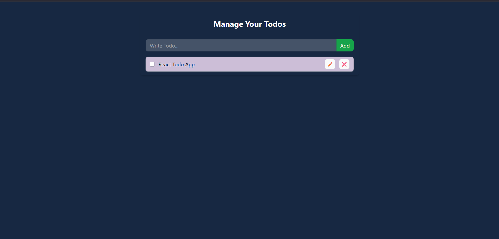

# React To-Do App

A simple and efficient To-Do list application built using React. It uses Context API for global state management and LocalStorage to persist tasks across sessions.

## 🔗 Visit the Website

[React To-Do App](https://maheshhattimare.github.io/react-todo-app/)

## 🚀 Features

- Add, delete, and mark tasks as completed
- Context API for state management
- Tasks stored in LocalStorage
- Responsive design

## 📸 Screenshots

### ✅ Interface



## 🧠 Learnings

While building this project, I learned:

- How to use React hooks like `useState`, `useContext`, and `useEffect`
- Creating and managing global state using Context API
- Persisting data using browser's LocalStorage
- Structuring a React project for scalability

## 🛠️ Technologies Used

- React
- JavaScript (ES6+)
- HTML & Tailwind CSS
- Context API
- LocalStorage

## 📦 Installation

1. Clone the repository:
   ```bash
   git clone https://github.com/maheshhattimare/react-todo-app.git
   ```
